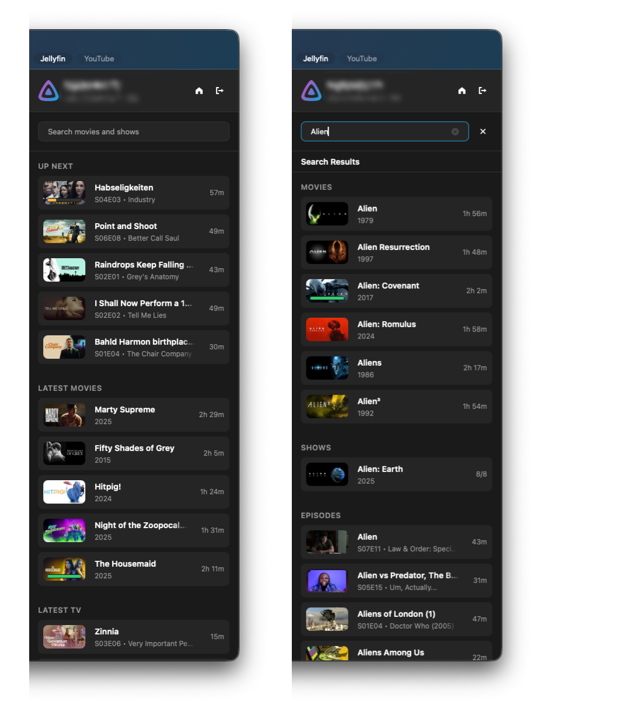

# Jellyfin IINA Plugin (Fork)

Plugin for accessing Movies and TV series from your Jellyfin server in IINA. Displays a simplified view of your library that lets you browse and play items right from IINA. **Not affiliated with the official Jellyfin Project.**

> This is a fork of [jellyfin-iina](https://github.com/ada-bee/jellyfin-iina) by [ada-bee](https://github.com/ada-bee), who created and maintains the original plugin. All credit for the original work goes to them. This fork exists for my personal setup and adds a few changes on top.

## What's different in this fork

- **HTTP server URLs are supported** (upstream requires https since v2.0.0). Useful for Tailscale/VPN or LAN setups where TLS is unnecessary. Plain http sends your credentials and media unencrypted, so only use it on a trusted network.
- **External subtitles are loaded** (e.g. downloaded by Bazarr). Sidecar subtitle files known to Jellyfin are fetched and added to mpv's subtitle tracks automatically, including for auto-played next episodes.

If you like this plugin you might also be interested in [YouTube IINA Plugin](https://github.com/ada-bee/youtube-iina).

## Installation

### From GitHub (release build)

1. In IINA, open Settings > Plugins.
2. Select Install from GitHub.
3. Enter `Justaway41/jellyfin-iina`
4. Restart IINA if it does not appear immediately.

### From source (development build)

```sh
git clone https://github.com/Justaway41/jellyfin-iina.git
cd jellyfin-iina
bun install
bun run build
ln -s "$(pwd)/xyz.brbc.jellyfin.iinaplugin" ~/Library/Application\ Support/com.colliderli.iina/plugins/
```

Restart IINA after linking. Re-run `bun run build` and restart IINA to pick up changes.

## Usage

- Open the Jellyfin sidebar with Shift+J.
- On next open you can use the "Resume Jellyfin.png" option in Recent Items to skip the select video dialog.
- Both `http://` and `https://` server URLs are supported. Plain http sends your credentials and media unencrypted, so only use it on a trusted network (e.g. Tailscale/VPN or localhost).

## Features

- Direct stream playback from Jellyfin. Transcoding is currently not supported.
- Library browsing. Home screen shows Next Up and Recently Added. You can search for anything else.
- Playback progress reporting back to the Jellyfin server.
- Resume playback from last position.
- Auto-play next episode (can be disabled). Next episode is added to the mpv playlist for native feel and media key support.
- Intro-skipper integration (can be disabled). Clickable Skip button shows up during Intro/Credits similarly to the web interface.
- External subtitle support (e.g. Bazarr downloads) with language and title labels in the subtitle menu.

## Screenshot



## Disclaimer

The original plugin was made by [ada-bee](https://github.com/ada-bee) primarily for their own use. This fork is likewise maintained for my personal setup and is largely vibe coded — use at your own risk.

## Attribution

- Original plugin: [ada-bee/jellyfin-iina](https://github.com/ada-bee/jellyfin-iina) by [ada-bee](https://github.com/ada-bee), licensed under [GPL-3.0](LICENSE).
- Includes logos and icons licensed under [CC-BY-SA-4.0](https://creativecommons.org/licenses/by-sa/4.0/) by the [Jellyfin Project](https://github.com/jellyfin/jellyfin-ux).
