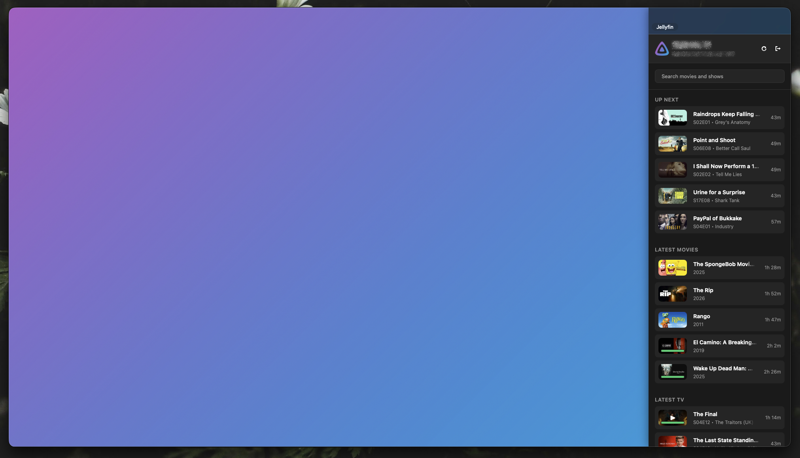
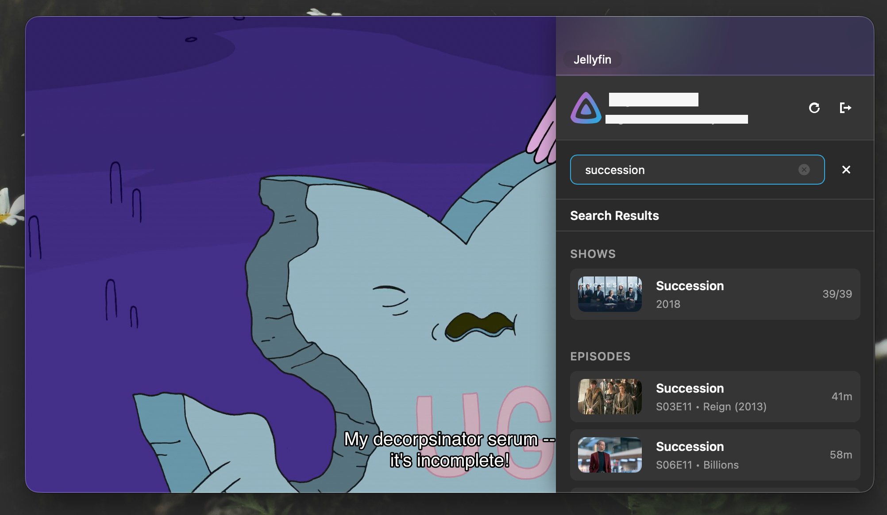

# Jellyfin IINA Plugin

Plugin for accessing Movies and TV series from your Jellyfin server in IINA. Displays a simplified view of your library that lets you browse and play items right from IINA. **Not affiliated with the official Jellyfin Project.**

## Installation

1. In IINA, open Settings > Plugins.
2. Select Install from GitHub.
3. Enter `ada-bee/jellyfin-iina`
4. Restart IINA if it does not appear immediately.

## Usage

- Open the Jellyfin sidebar with Shift+J.
- On next open you can use the "Resume Jellyfin.png" option in Recent Items to skip the select video dialog.
- Warning: **https is required** since v2.0.0

## Features

- Direct stream playback from Jellyfin. Transcoding is currently not supported.
- Library browsing. Home screen shows Next Up and Recently Added. You can search for anything else.
- Playback progress reporting back to the Jellyfin server.
- Resume playback from last position.
- Auto-play next episode (can be disabled). Next episode is added to the mpv playlist for native feel and media key support.
- Intro-skipper integration (can be disabled). Clickable Skip button shows up during Intro/Credits similarly to the web interface.

## Screenshots

## Disclaimer

This was made primarily for me and was largely vibe coded. While this is my daily driver and I intend to maintain, it should be considered mostly feature complete as it already does everything I need.

## Attribution

Includes logos and icons licensed under [CC-BY-SA-4.0](https://creativecommons.org/licenses/by-sa/4.0/) by the [Jellyfin Project](https://github.com/jellyfin/jellyfin-ux).
